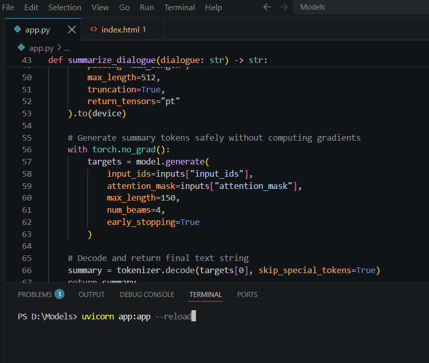
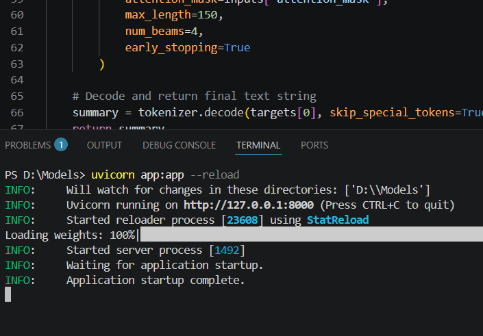
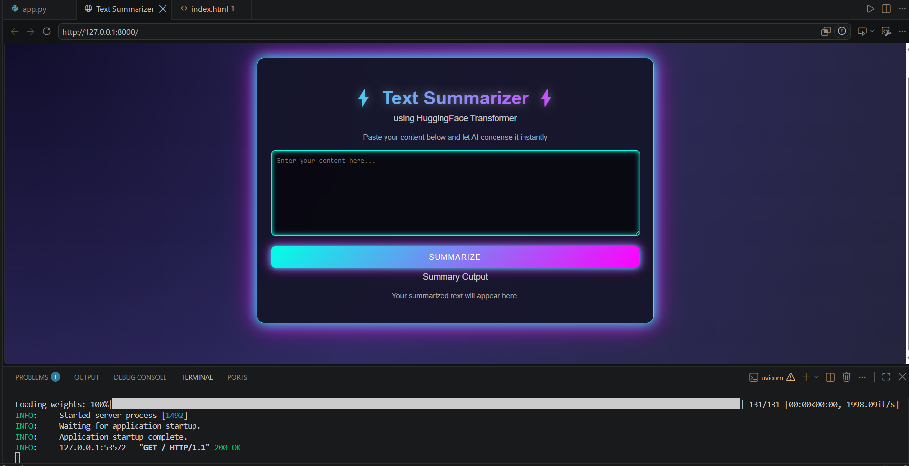
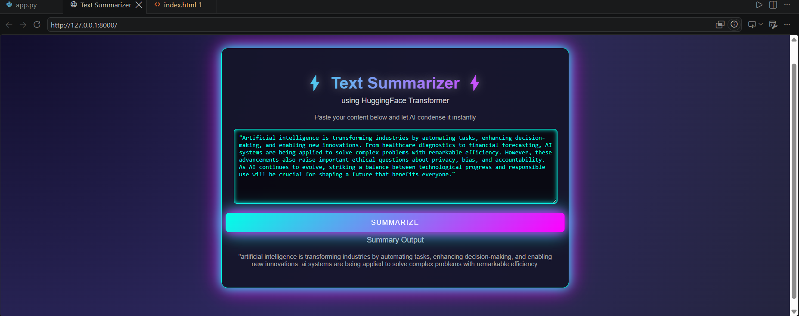

### AI Text Summarizer 🤖📝

A modern, lightweight web application that uses an open-source Artificial Intelligence model to instantly summarize long articles and text blocks. 

This project runs a Deep Learning model completely locally on your system, requiring zero external API keys or paid cloud subscriptions. 

### 🚀 Key Features

* **Local AI Execution:** Powered by Hugging Face's T5 Transformer model running locally via PyTorch.
* **Asynchronous Backend:** Built using FastAPI for high-performance and fast request handling.
* **Clean Web UI:** A simple and intuitive HTML/CSS user interface for inputting text and reading summaries.
* **Zero API Costs:** No OpenAI or third-party paid tokens needed.

### 🛠️ Tech Stack

* **Framework:** FastAPI (Python)
* **AI/ML Libraries:** Hugging Face Transformers, PyTorch
* **Frontend:** HTML5, CSS3, Jinja2 Templates

### 📦 Installation & Local Setup

Follow these simple steps to run this project on your machine: 

1. **Clone the repository:** 

bash

git clone https://github.com/aminT45/Text_Summarizer.git
cd Text_Summarizer

Use code with caution.
2. **Install the required packages:** 

bash

pip install -r requirements.txt

Use code with caution.
3. **Start the FastAPI server:** 

bash

uvicorn app:app --reload

Use code with caution.
4. **Access the application:**
Open your browser and navigate to: http://123.0.0.1:8000

### 📸 Application Preview

### 💡 How It Works

1. The user inputs a long paragraph or article into the web interface.
2. FastAPI sends the text to the backend where the **T5-Small** tokeniser converts the text into machine-readable tensors.
3. The local PyTorch model processes the data and generates a concise, high-quality summary.
4. The output is rendered instantly back onto the HTML screen without reloading the page.
